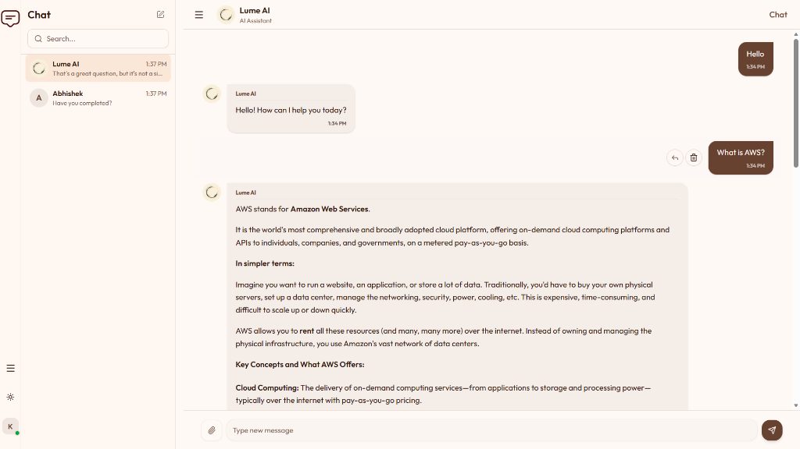

# Lume Chat

Lume is a modern, real-time chat application with integrated multimodal AI capabilities. Built with scalability and user experience in mind, it allows users to have seamless conversations and interact with an intelligent AI assistant that can analyze images and maintain context.

**Live Demo**: [https://lume-chat.onrender.com/](https://lume-chat.onrender.com/)  
**Source Code**: [https://github.com/Abhishek-Jaiswar/lume-chat](https://github.com/Abhishek-Jaiswar/lume-chat)



## Features

- **Real-time Messaging**: Instant message delivery using Socket.io.
- **Multimodal AI Assistant**: Integrated Lume AI (powered by Google Gemini) that can process text and images.
- **Context-Aware Replies**: AI understands context when replying to specific messages.
- **Real-time AI Streaming**: Responses from Lume AI are streamed in real-time for a dynamic experience.
- **Image Sharing**: Upload and share images within chats.
- **Modern UI/UX**: Sleek, responsive design built with Tailwind CSS and Shadcn/UI.

## Tech Stack

### Frontend
- **React 19** with **Vite**
- **TypeScript**
- **Tailwind CSS** & **Shadcn/UI**
- **Socket.io-client**
- **Zustand** (State Management)
- **React Hook Form** & **Zod** (Validation)

### Backend
- **Node.js** & **Express**
- **MongoDB** with **Mongoose**
- **Socket.io**
- **Google Generative AI SDK** (Gemini 2.0 Flash)
- **Cloudinary** (Image Storage)
- **Passport.js** (Authentication)

## Project Structure

```text
├── client/          # Frontend React application
└── server/          # Backend Node.js API & Socket server
```

## Environment Variables

### Server (`server/.env`)
Create a `.env` file in the `server` directory with the following:
```env
PORT=5000
MONGO_URI=your_mongodb_connection_string
JWT_SECRET=your_jwt_secret
JWT_EXPIRES_IN=1d
FRONTEND_URL=http://localhost:5173
CLOUD_NAME=your_cloudinary_name
CLOUDINARY_API_KEY=your_cloudinary_api_key
CLOUDINARY_API_SECRET=your_cloudinary_api_secret
GOOGLE_GENERATIVE_AI_API_KEY=your_gemini_api_key
```

### Client (`client/.env`)
Create a `.env` file in the `client` directory:
```env
VITE_API_URL=http://localhost:5000
```

## Getting Started

### 1. Clone the repository
```bash
git clone https://github.com/Abhishek-Jaiswar/lume-chat
cd chatapp
```

### 2. Setup Server
```bash
cd server
pnpm install
pnpm run dev
```

### 3. Setup Client
```bash
cd client
pnpm install
pnpm run dev
```

## Deployment (Render)

Lume is optimized for deployment on **Render**.

1. **Backend**:
   - Create a new "Web Service" on Render.
   - Connect your repository.
   - Set the Root Directory to `server`.
   - Build Command: `pnpm install && pnpm run build`
   - Start Command: `node dist/index.js`
   - Add your Environment Variables in the Render dashboard.

2. **Frontend**:
   - Create a new "Static Site" on Render.
   - Set the Root Directory to `client`.
   - Build Command: `pnpm install && pnpm run build`
   - Publish Directory: `dist`
   - Add `VITE_API_URL` to your Environment Variables.

---
Developed with ❤️ by Abhishek Jaiswar
